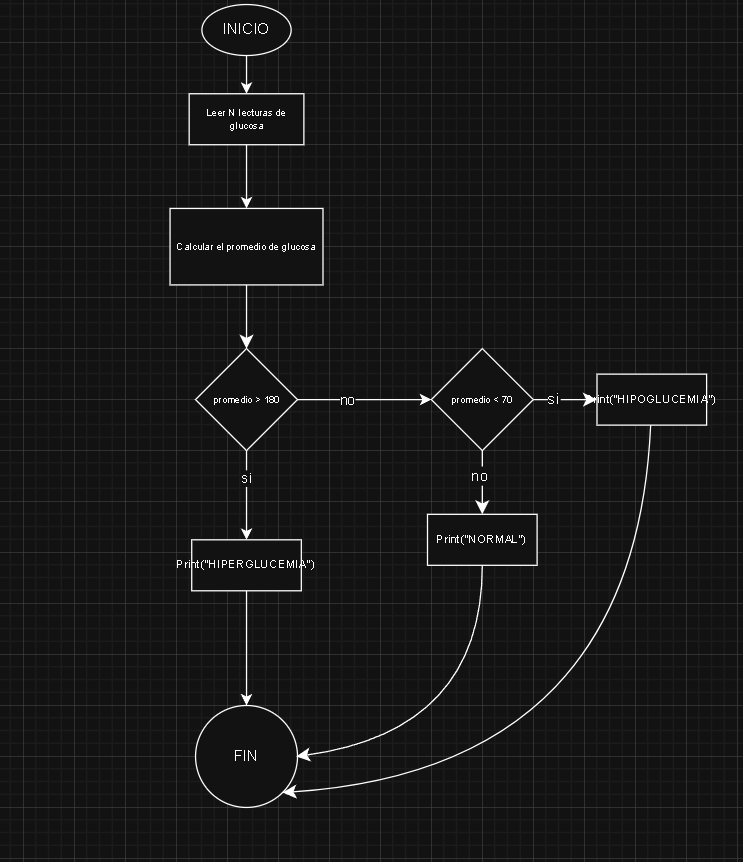

# Casos Clínicos P1

Este repositorio contiene la solución a tres casos clínicos:

1. **Alertas de glucemia**  
   - Se analizan lecturas de glucosa para clasificar el estado del paciente.

2. **Detección de arritmia simple**  
   - Se evalúan valores de frecuencia cardíaca para detectar posibles arritmias.

3. **Velocidad de infusión IV**  
   - Se calcula la velocidad de infusión a partir de la dosis prescrita y concentración.

